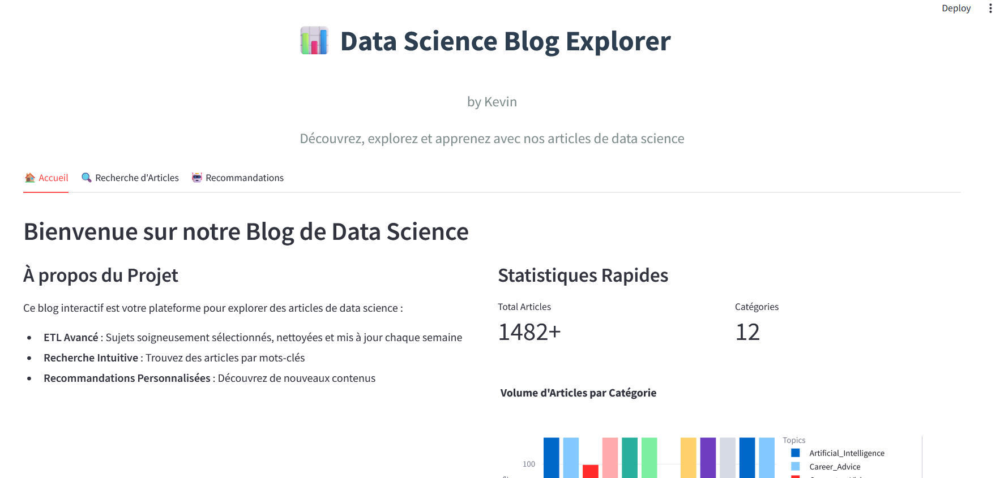
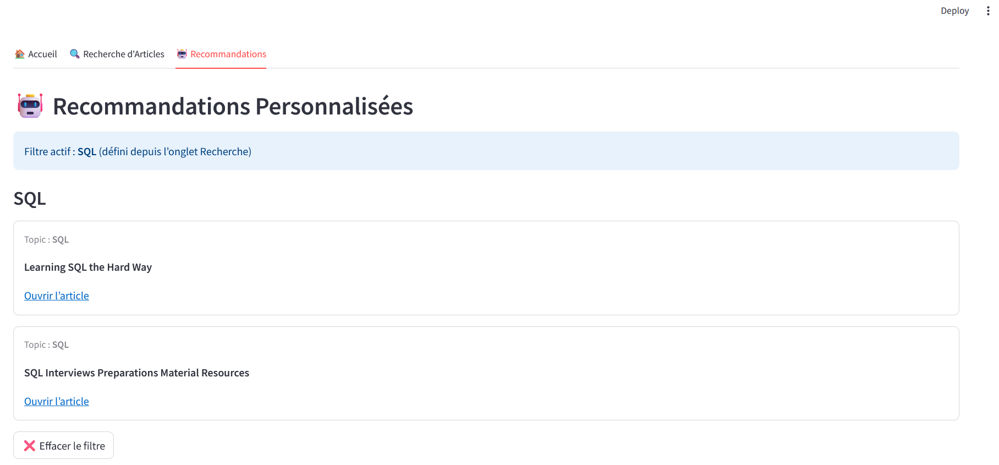
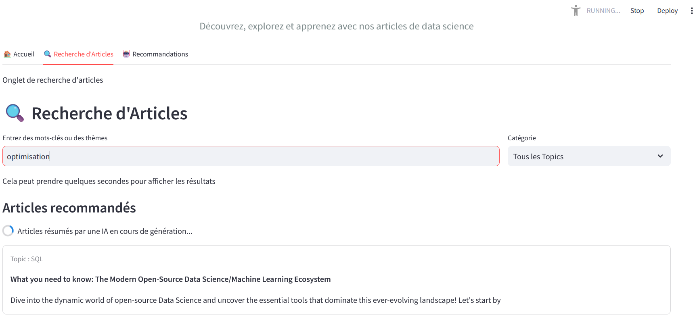

# 📰 Data Articles : Application d'Analyse et de Recommandation d'Articles avec IA

### 🚀 Une plateforme interactive pour explorer, analyser et recommander des articles grâce au traitement automatique du langage (TAL / NLP)

---

## 🌟 Aperçu

**Data Articles** est une application développée en **Python** et **Streamlit**, propulsée par des modèles d'intelligence artificielle (**Mistral**, via Ollama) pour analyser et résumer des articles récents issus du web.

Elle combine :
- 🕸️ **Scraping automatique** d'articles en ligne  
- 🧹 **Nettoyage et prétraitement NLP** (spaCy, NLTK, Dask)  
- 📊 **Analyse thématique** (TF-IDF, wordclouds, visualisations Plotly)  
- 🧠 **Recommandation de contenu** basée sur la similarité sémantique  
- 🤖 **Résumé intelligent** généré par un modèle IA local (Mistral via Ollama)

📸 [acceuil](screenshoots/app_home.png)

---

## 🧰 Stack Technique

| Catégorie | Outils & Technologies |
|------------|----------------------|
| **Langage principal** | Python 3.11 |
| **Framework UI** | [Streamlit](https://streamlit.io) |
| **Scraping web** | BeautifulSoup, lxml, urllib |
| **Traitement NLP** | spaCy, NLTK, Unidecode |
| **Machine Learning** | Scikit-learn (TF-IDF, Cosine Similarity) |
| **Big Data / Parallélisation** | Dask |
| **Visualisation** | Plotly, Matplotlib, WordCloud |
| **IA Générative** | Ollama + Mistral |
| **Déploiement local** | Docker & Docker Compose |

---

## 🧠 Fonctionnalités clés

### 🔍 1. Extraction & Nettoyage de Données
- Scraping automatique d'articles via `scrapping_data.py`
- Nettoyage, racinisation et normalisation linguistique via `load_treat_data.py`

### 🧩 2. Exploration des Thématiques
- Affichage interactif des topics (clusters thématiques)
- Visualisation de nuages de mots et distributions de fréquence

### 💡 3. Recommandations Personnalisées
- Moteur de recommandation sémantique basé sur **TF-IDF** et **cosine similarity**
- Filtrage dynamique par catégorie ou recherche libre

### 🧾 4. Résumé IA (Mistral via Ollama)
- Génération de résumés synthétiques d'articles
- Fonction de streaming en direct dans l'interface Streamlit

---

## 🧑‍💻 Installation & Lancement

### 🐳 Option 1 — Lancer avec Docker (recommandé)

#### ✅ Prérequis
- [Docker Desktop](https://www.docker.com/products/docker-desktop)
- Espace disque suffisant (~8 Go pour Ollama + Mistral)

#### ⚙️ Étapes

1️⃣ **Cloner le projet**
```bash
git clone https://github.com/KevinKen237/Data-Articles.git
cd Data-Articles
```

2️⃣ **Construire et lancer l'environnement**
```bash
docker compose up --build
```

3️⃣ **Télécharger le modèle Mistral dans le conteneur Ollama**
```bash
docker exec -it ollama bash
ollama pull mistral:instruct
exit
```

4️⃣ **Ouvrir l'application**
[http://localhost:8501](http://localhost:8501)

---

### 💻 Option 2 — Lancer sans Docker (mode dev)

#### Prérequis
- Python ≥ 3.10  
- Ollama installé localement ([voir documentation officielle](https://ollama.ai))

#### Étapes

1️⃣ **Installer les dépendances**
```bash
pip install -r requirements.txt
```

2️⃣ **Télécharger le modèle Mistral**
```bash
ollama pull mistral:instruct
```

3️⃣ **Scraper et traiter les données**
```bash
python scrapping_data.py
python load_treat_data.py
```

4️⃣ **Lancer l'application**
```bash
streamlit run app.py
```

---

## 🧾 Structure du Projet

```bash
Data-Articles/
│
├── app.py                   # Application Streamlit principale
├── model.py                 # Fonctions IA et résumé Mistral
├── utilities_function.py    # Fonctions utilitaires (viz, reco, NLP)
├── load_treat_data.py       # Traitement et nettoyage des données
├── scrapping_data.py        # Scraping des articles
│
├── data/                    # Données locales montées en volume
├── credentials/             # (optionnel) Identifiants API ou configs
│
├── requirements.txt         # Dépendances Python
├── Dockerfile               # Image du conteneur app
├── docker-compose.yml       # Lancement multi-services (app + Ollama)
└── README.md                # Ce fichier
```

---

## 📊 Interface de l'application

Quelques captures d'écran pour illustrer les principales sections de l'application :

| Section | Capture d'écran |
|----------|----------------|
| 🏠 **Accueil / Dashboard** |  |
| ☁️ **Nuage de mots** |  |
| 🧠 **Recommandation IA** |  |
| 📰 **Résumé IA (Mistral)** |  |

---

## ⚡ Pipeline de fonctionnement

```
┌────────────────────┐
│  Scraping Web      │  ← scrapping_data.py
└────────┬───────────┘
         ↓
┌────────────────────┐
│  Nettoyage NLP     │  ← load_treat_data.py
└────────┬───────────┘
         ↓
┌────────────────────┐
│  Analyse / TF-IDF  │  ← utilities_function.py
└────────┬───────────┘
         ↓
┌────────────────────┐
│  Recommandations   │
│  & Résumé IA       │  ← app.py + model.py
└────────────────────┘
```

---

## 🔒 Données et Confidentialité

Les données sont extraites uniquement à partir de **sources publiques d'articles**.  
Aucune donnée personnelle ni API externe sensible n'est utilisée.  
Le traitement NLP et la génération IA s'exécutent **localement**, sans envoi vers le cloud.

---

## 💬 À propos

👋 **Auteur : [Kevin Kenang](https://github.com/KevinKen237)**, **Data scientist | Data analyst**  
🎓 Master 2 : Mathématiques appliquées statistiques, parcours Data science et IA 
💼 Objectif : démontrer une maîtrise complète du pipeline **Data → NLP → IA → Interface utilisateur**

---

## 🏁 En résumé

| Compétence démontrée | Technologies |
|----------------------|--------------|
| Web Scraping | BeautifulSoup, lxml |
| Data Cleaning | spaCy, NLTK, Unidecode |
| Recommandation & Similarité | Scikit-learn, TF-IDF |
| IA Générative | Ollama + Mistral |
| Interface interactive | Streamlit, Plotly |
| Déploiement local | Docker Compose |
| Gestion de pipeline | Dask, Pandas |

---

### ⭐ Si ce projet vous a plu, n'hésitez pas à
- mettre une ⭐ sur le repo GitHub  
- ou me contacter sur [Boîte Mail](kevinkenang.pro@gmail.com) pour discuter de projets Data, IA, NLP !

